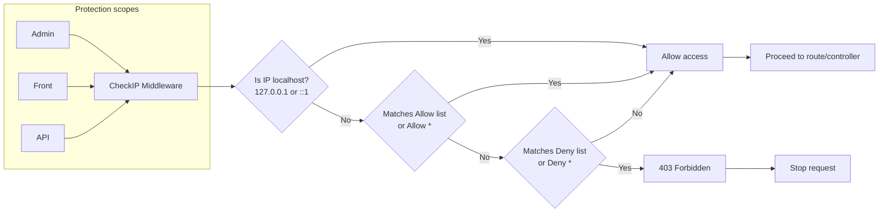

# CheckIP Plugin (English)

CheckIP plugin helps manage and block IP addresses accessing the GP247 system.

## Features
- Manage IP lists with two types: **allow** and **deny**.
- Support wildcard `*`:
  - `*` in allow: allow all IPs.
  - `*` in deny: deny all IPs (unless already allowed beforehand).
- Processing priority: allow > deny.
- Intuitive admin UI to create/update/delete.
- Field `status` (ON/OFF) per record to quickly enable/disable (default ON when creating new).

## Middleware
- Class: `App\GP247\Plugins\CheckIP\Middleware\CheckIP`
- Flow (simplified):
  1. If IP matches allow list (or allow `*`) or is localhost (`127.0.0.1`, `::1`) => allow.
  2. Else, if IP matches deny list (or deny `*`) => return 403.
  3. Otherwise => allow.

## Activity Diagram

Protection scopes: Admin, Front, API (all go through the `CheckIP` middleware).

## Installation
You can install using the following methods (similar to the plugin guide on GP247 Store):

### Method 1 (Manual)
1. Copy the source code into the folder `app/GP247/Plugins/CheckIP`.
2. Go to Admin > Plugins, find the CheckIP plugin to install and activate.

### Method 2 (Import ZIP file)
1. Go to Admin > Plugins > tab "Install from file".
2. Upload the plugin ZIP package and confirm installation.

### Method 3 (Library)
1. Go to Admin > Plugins > tab "Plugin Library".
2. Find "CheckIP" and click Install.

## Activation & Usage
- After installation, go to Admin > Security > CheckIP (menu name under SECURITY group) to manage.
- Create a record:
  - `description`: short description.
  - `ip`: IP address (e.g., `203.0.113.10`) or `*`.
  - `type`: choose `allow` or `deny`.
  - `status`: ON to apply, OFF to temporarily disable.
- Note: `allow` has higher priority than `deny`.

## Links
- Reference page (GP247 Store): `https://gp247.net/en/product/plugin-checkip.html`
- GitHub (source code): `https://github.com/gp247net/CheckIP`

## License
Plugin developed by GP247.
