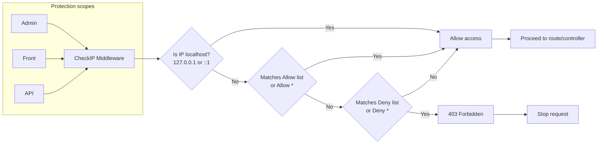

# CheckIP Plugin (English)

CheckIP plugin helps manage and block IP addresses accessing the GP247 system.

## Features
- Manage IP lists with two types: **allow** and **deny**.
- Support wildcard `*`:
  - `*` in allow: allow all IPs.
  - `*` in deny: deny all IPs (unless already allowed beforehand).
- Processing priority: allow > deny.
- Intuitive admin UI to create/update/delete.
- Field `status` (ON/OFF) per record to quickly enable/disable (default ON when creating new).

## Architecture & Data Schema
- Table: `check_ip_access`
- Main columns:
  - `id` (int, PK)
  - `ip` (varchar(20)) — IP address or `*`
  - `description` (varchar(255), nullable)
  - `type` (varchar(10)) — `allow` | `deny`
  - `status` (varchar(10), index, default 1) — `1` (ON) | `0` (OFF)
  - `timestamps`

## Middleware
- Class: `App\GP247\Plugins\CheckIP\Middleware\CheckIP`
- Flow (simplified):
  1. If IP matches allow list (or allow `*`) or is localhost (`127.0.0.1`, `::1`) => allow.
  2. Else, if IP matches deny list (or deny `*`) => return 403.
  3. Otherwise => allow.

Hint: If you only want to apply active records, filter `status = 1` when querying the allow/deny lists in the Model.

## Activity Diagram

Protection scopes: Admin, Front, API (all go through the `CheckIP` middleware).

## Installation
You can install using the following methods (similar to the plugin guide on GP247 Store):

### Method 1 (Manual)
1. Copy the source code into the folder `app/GP247/Plugins/CheckIP`.
2. Go to Admin > Plugins, find the CheckIP plugin to install and activate.

### Method 2 (Import ZIP file)
1. Go to Admin > Plugins > tab "Install from file".
2. Upload the plugin ZIP package and confirm installation.

### Method 3 (Library)
1. Go to Admin > Plugins > tab "Plugin Library".
2. Find "CheckIP" and click Install.

## Activation & Usage
- After installation, go to Admin > Security > CheckIP (menu name may be under SECURITY group) to manage.
- Create a record:
  - `description`: short description.
  - `ip`: IP address (e.g., `203.0.113.10`) or `*`.
  - `type`: choose `allow` or `deny`.
  - `status`: ON to apply, OFF to temporarily disable.
- Note: `allow` has higher priority than `deny`.

## Links
- Reference page (GP247 Store): `https://gp247.net/vi/product/plugin-checkip.html`
- GitHub (source code): `https://github.com/gp247net/CheckIP`

## License
Plugin developed by GP247.

# CheckIP Plugin (English)

CheckIP helps you control application access by IP address. Admins can configure allow/deny lists, support wildcard `*`, and quickly enable/disable individual rules with a status flag.

Inspired by the documentation style used across GP247 plugins (see reference link below) to keep a consistent installation and usage experience.

## Features
- Manage IP list with two types: **allow** and **deny**.
- Wildcard support `*`:
  - `*` in allow: allow all IPs.
  - `*` in deny: deny all IPs (unless specifically allowed).
- Priority handling: allow > deny.
- Automatically reads IPs from `CF-Connecting-IP`, `X-Forwarded-For`, and `request()->ips()`.
- Admin UI for create/update/delete.
- `status` (ON/OFF) per record to quickly toggle a rule (default ON for new records).

## Data schema
- Table: `check_ip_access`
- Main columns:
  - `id` (int, PK)
  - `ip` (varchar(20)) — an IP address or `*`
  - `description` (varchar(255), nullable)
  - `type` (varchar(10)) — `allow` | `deny`
  - `status` (varchar(10), index, default 1) — `1` (ON) | `0` (OFF)
  - `timestamps`

## Middleware
- Class: `App\\GP247\\Plugins\\CheckIP\\Middleware\\CheckIP`
- Flow (simplified):
  1. If any IP matches the allow list (or allow `*`) or request is from localhost (`127.0.0.1`, `::1`) => allow.
  2. Otherwise, if any IP matches the deny list (or deny `*`) => abort 403.
  3. If nothing matches => allow.

Tip: If you want to apply only active records at runtime, filter with `status = 1` in your model queries for both allow and deny.

## Installation
You can install the plugin similarly to other GP247 plugins:

### Method 1 (Manual)
1. Copy source code to `app/GP247/Plugins/CheckIP`.
2. Go to Admin > Plugins, find CheckIP and install/enable it.

### Method 2 (ZIP import)
1. Admin > Plugins > "Install from file" tab.
2. Upload the ZIP package and confirm installation.

### Method 3 (Library)
1. Admin > Plugins > "Plugin library" tab.
2. Search for "CheckIP" and click Install.

## Usage
- After installation, navigate to Admin > Security > CheckIP (menu group may vary) to manage entries.
- Create a record with:
  - `description`: short note
  - `ip`: an IP (e.g. `203.0.113.10`) or `*`
  - `type`: `allow` or `deny`
  - `status`: ON to apply, OFF to temporarily disable
- Note: `allow` takes priority over `deny`.

## Notes on `status`
- The admin UI supports toggling `status` and displays it in listing (ON/OFF).
- For runtime filtering, update your model queries to include `status = 1` when retrieving allow/deny lists.

## Links
- Reference (GP247 Store): `https://gp247.net/en/product/plugin-checkip.html`
- GitHub (source): `https://github.com/gp247net/CheckIP`

## License
Developed by GP247.