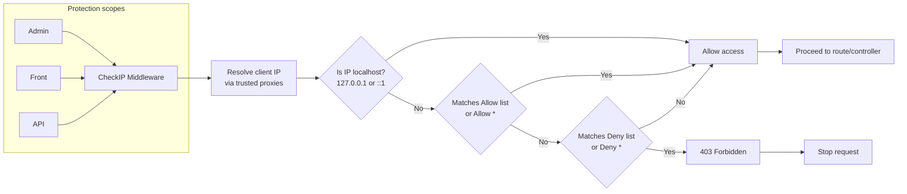

# CheckIP Plugin (English)

🌐 **English** | [Tiếng Việt](readme_vi.md)

CheckIP plugin helps manage and block IP addresses accessing the GP247 system.

> **Requires GP247 Core 2.0.** The admin screen runs on the TailAdmin (Livewire) shell.

## Features
- Manage IP lists with two types: **allow** and **deny**.
- Support wildcard `*`:
  - `*` in allow: allow all IPs.
  - `*` in deny: deny all IPs (unless already allowed beforehand).
- Processing priority: allow > deny.
- Livewire admin UI (TailAdmin) to create/update/delete, with add/edit form and allow/deny lists side by side.
- Field `status` (ON/OFF) per record to quickly enable/disable (default ON when creating new).

## Middleware
- Class: `App\GP247\Plugins\CheckIP\Middleware\CheckIP`
- Flow (simplified):
  1. Resolve the client IP from the framework (`request()->ips()`), honouring trusted proxies (see below).
  2. If IP matches allow list (or allow `*`) or is localhost (`127.0.0.1`, `::1`) => allow.
  3. Else, if IP matches deny list (or deny `*`) => return 403.
  4. Otherwise => allow.

## Client IP & trusted proxies
The client IP is resolved by Laravel via `request()->ips()`, which honours `config/trustedproxy.php`
(the `TRUSTED_PROXIES` env value). Forwarded headers (`X-Forwarded-For`, `CF-Connecting-IP`) are **not**
trusted unless they come from a proxy you explicitly declare — this prevents a client from spoofing a
header (e.g. `X-Forwarded-For: 127.0.0.1`) to bypass deny rules.

- **Bare host** (Nginx/Apache → PHP-FPM directly): leave `TRUSTED_PROXIES` unset. The real client IP is
  the direct connection — nothing to trust.
- **Behind a reverse proxy / Cloudflare**: set `TRUSTED_PROXIES` in `.env` (e.g. `127.0.0.1` for a local
  `proxy_pass`, or Cloudflare's IP ranges) so the genuine visitor IP is detected. If you do not, every
  visitor appears as the proxy's IP and the allow/deny rules apply to all of them together.
- **Localhost** (`127.0.0.1`, `::1`) is always allowed, so local access is never locked out.

> ⚠️ The middleware also protects the **Admin** area. Avoid a deny `*` (or denying your own IP) unless a
> trusted allow rule keeps your access — otherwise you may lock yourself out and have to edit the database
> to recover.

## Activity Diagram

Protection scopes: Admin, Front, API (all go through the `CheckIP` middleware).

```mermaid
flowchart LR
    subgraph Contexts[Protection scopes]
        A[Admin] --> M
        B[Front] --> M
        C[API] --> M
    end

    M[CheckIP Middleware] --> R[Resolve client IP<br/>via trusted proxies]
    R --> D1{Is IP localhost?<br/>127.0.0.1 or ::1}
    D1 -- Yes --> ALLOW[Allow access]
    D1 -- No --> D2{Matches Allow list<br/>or Allow *}
    D2 -- Yes --> ALLOW
    D2 -- No --> D3{Matches Deny list<br/>or Deny *}
    D3 -- Yes --> DENY[403 Forbidden]
    D3 -- No --> ALLOW

    ALLOW --> NEXT[Proceed to route/controller]
    DENY --> STOP[Stop request]
```

## Installation
You can install using the following methods (similar to the plugin guide on GP247 Store):

### Method 1 (Manual)
1. Copy the source code into the folder `app/GP247/Plugins/CheckIP`.
2. Go to Admin > Plugins, find the CheckIP plugin to install and activate.

### Method 2 (Import ZIP file)
1. Go to Admin > Plugins > tab "Install from file".
2. Upload the plugin ZIP package and confirm installation.

### Method 3 (Library)
1. Go to Admin > Plugins > tab "Plugin Library".
2. Find "CheckIP" and click Install.

## Activation & Usage
- After installation, go to Admin > Security > CheckIP (menu name under SECURITY group) to manage.
- Create a record:
  - `description`: short description.
  - `ip`: IP address (e.g., `203.0.113.10`) or `*`.
  - `type`: choose `allow` or `deny`.
  - `status`: ON to apply, OFF to temporarily disable.
- Note: `allow` has higher priority than `deny`.

## Links
- Reference page (GP247 Store): `https://gp247.net/en/product/plugin-checkip.html`
- GitHub (source code): `https://github.com/gp247net/CheckIP`

## License
Plugin developed by GP247.

---
**Last updated:** 2026-08-03
