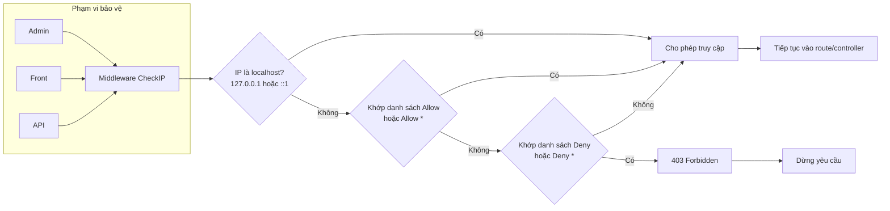

# CheckIP Plugin (Tiếng Việt)

Plugin CheckIP hỗ trợ quản lý và ngăn chặn IP truy cập vào hệ thống GP247.

## Tính năng
- Quản lý danh sách IP theo 2 loại: **allow** và **deny**.
- Hỗ trợ ký tự `*`:
  - `*` trong allow: cho phép tất cả IP.
  - `*` trong deny: chặn tất cả IP (trừ khi đã được allow trước đó).
- Ưu tiên xử lý: allow > deny.
- Giao diện quản trực quan, hỗ trợ tạo/sửa/xóa.
- Trường trạng thái `status` (ON/OFF) cho từng bản ghi để bật/tắt nhanh mục cấu hình (mặc định ON khi tạo mới).

## Middleware
- Lớp: `App\GP247\Plugins\CheckIP\Middleware\CheckIP`
- Luồng xử lý (rút gọn):
  1. Nếu IP khớp danh sách allow (hoặc allow `*`) hoặc là localhost (`127.0.0.1`, `::1`) => cho phép.
  2. Ngược lại, nếu IP khớp danh sách deny (hoặc deny `*`) => trả về 403.
  3. Nếu không khớp gì => cho phép.

## Sơ đồ hoạt động

Phạm vi bảo vệ: Admin, Front, API (đều đi qua middleware `CheckIP`).

## Cài đặt
Có thể cài đặt theo các cách sau (tương tự tài liệu plugin trên GP247 Store):

### Cách 1 (Thủ công)
1. Sao chép mã nguồn vào thư mục `app/GP247/Plugins/CheckIP`.
2. Vào Admin > Plugins, tìm plugin CheckIP để cài đặt và kích hoạt.

### Cách 2 (Import file ZIP)
1. Vào Admin > Plugins > tab "Cài đặt từ file".
2. Tải lên gói ZIP của plugin và xác nhận cài đặt.

### Cách 3 (Thư viện)
1. Vào Admin > Plugins > tab "Thư viện plugin".
2. Tìm "CheckIP" và nhấn Cài đặt.

## Kích hoạt & Sử dụng
- Sau khi cài đặt, vào Admin > Bảo mật > CheckIP (tên menu trong nhóm SECURITY) để quản lý.
- Tạo bản ghi:
  - `description`: mô tả ngắn.
  - `ip`: địa chỉ IP (ví dụ: `203.0.113.10`) hoặc `*`.
  - `type`: chọn `allow` hoặc `deny`.
  - `status`: ON để áp dụng, OFF để tạm tắt.
- Lưu ý: `allow` có ưu tiên cao hơn `deny`.

## Liên kết
- Trang tham khảo (GP247 Store): `https://gp247.net/vi/product/plugin-checkip.html`
- GitHub (mã nguồn): `https://github.com/gp247net/CheckIP`

## Giấy phép
Plugin được phát triển bởi GP247.