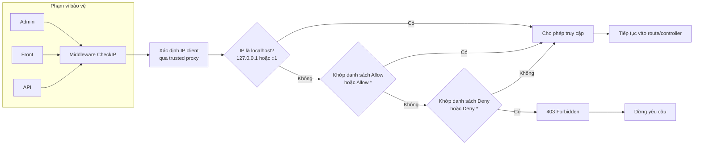

# CheckIP Plugin (Tiếng Việt)

🌐 [English](readme.md) | **Tiếng Việt**

Plugin CheckIP hỗ trợ quản lý và ngăn chặn IP truy cập vào hệ thống GP247.

> **Yêu cầu GP247 Core 2.0.** Màn hình quản trị chạy trên shell TailAdmin (Livewire).

## Tính năng
- Quản lý danh sách IP theo 2 loại: **allow** và **deny**.
- Hỗ trợ ký tự `*`:
  - `*` trong allow: cho phép tất cả IP.
  - `*` trong deny: chặn tất cả IP (trừ khi đã được allow trước đó).
- Ưu tiên xử lý: allow > deny.
- Giao diện quản trị Livewire (TailAdmin) hỗ trợ tạo/sửa/xóa, với form thêm/sửa và danh sách allow/deny đặt cạnh nhau.
- Trường trạng thái `status` (ON/OFF) cho từng bản ghi để bật/tắt nhanh mục cấu hình (mặc định ON khi tạo mới).

## Middleware
- Lớp: `App\GP247\Plugins\CheckIP\Middleware\CheckIP`
- Luồng xử lý (rút gọn):
  1. Lấy IP client từ framework (`request()->ips()`), tôn trọng cấu hình trusted proxy (xem bên dưới).
  2. Nếu IP khớp danh sách allow (hoặc allow `*`) hoặc là localhost (`127.0.0.1`, `::1`) => cho phép.
  3. Ngược lại, nếu IP khớp danh sách deny (hoặc deny `*`) => trả về 403.
  4. Nếu không khớp gì => cho phép.

## IP client & trusted proxy
IP client được Laravel xác định qua `request()->ips()`, dựa theo `config/trustedproxy.php`
(giá trị env `TRUSTED_PROXIES`). Các header chuyển tiếp (`X-Forwarded-For`, `CF-Connecting-IP`) **không**
được tin trừ khi đến từ proxy do bạn khai báo rõ ràng — điều này ngăn client giả mạo header
(ví dụ `X-Forwarded-For: 127.0.0.1`) để lách các rule deny.

- **Bare host** (Nginx/Apache → PHP-FPM trực tiếp): để trống `TRUSTED_PROXIES`. IP client thật chính là
  kết nối trực tiếp — không có proxy nào để tin.
- **Sau reverse proxy / Cloudflare**: đặt `TRUSTED_PROXIES` trong `.env` (ví dụ `127.0.0.1` cho
  `proxy_pass` cục bộ, hoặc dải IP của Cloudflare) để nhận đúng IP người truy cập thật. Nếu không đặt,
  mọi người truy cập sẽ hiện là IP của proxy và các rule allow/deny sẽ áp chung cho tất cả.
- **Localhost** (`127.0.0.1`, `::1`) luôn được cho phép, nên truy cập cục bộ không bao giờ bị khóa.

> ⚠️ Middleware cũng bảo vệ khu vực **Admin**. Tránh đặt deny `*` (hoặc deny chính IP của bạn) trừ khi có
> một rule allow tin cậy giữ quyền truy cập — nếu không bạn có thể tự khóa mình và phải sửa trực tiếp
> database để khôi phục.

## Sơ đồ hoạt động

Phạm vi bảo vệ: Admin, Front, API (đều đi qua middleware `CheckIP`).

```mermaid
flowchart LR
    subgraph Contexts[Phạm vi bảo vệ]
        A[Admin] --> M
        B[Front] --> M
        C[API] --> M
    end

    M[Middleware CheckIP] --> R[Xác định IP client<br/>qua trusted proxy]
    R --> D1{IP là localhost?<br/>127.0.0.1 hoặc ::1}
    D1 -- Có --> ALLOW[Cho phép truy cập]
    D1 -- Không --> D2{Khớp danh sách Allow<br/>hoặc Allow *}
    D2 -- Có --> ALLOW
    D2 -- Không --> D3{Khớp danh sách Deny<br/>hoặc Deny *}
    D3 -- Có --> DENY[403 Forbidden]
    D3 -- Không --> ALLOW

    ALLOW --> NEXT[Tiếp tục vào route/controller]
    DENY --> STOP[Dừng yêu cầu]
```

## Cài đặt
Có thể cài đặt theo các cách sau (tương tự tài liệu plugin trên GP247 Store):

### Cách 1 (Thủ công)
1. Sao chép mã nguồn vào thư mục `app/GP247/Plugins/CheckIP`.
2. Vào Admin > Plugins, tìm plugin CheckIP để cài đặt và kích hoạt.

### Cách 2 (Import file ZIP)
1. Vào Admin > Plugins > tab "Cài đặt từ file".
2. Tải lên gói ZIP của plugin và xác nhận cài đặt.

### Cách 3 (Thư viện)
1. Vào Admin > Plugins > tab "Thư viện plugin".
2. Tìm "CheckIP" và nhấn Cài đặt.

## Kích hoạt & Sử dụng
- Sau khi cài đặt, vào Admin > Bảo mật > CheckIP (tên menu trong nhóm SECURITY) để quản lý.
- Tạo bản ghi:
  - `description`: mô tả ngắn.
  - `ip`: địa chỉ IP (ví dụ: `203.0.113.10`) hoặc `*`.
  - `type`: chọn `allow` hoặc `deny`.
  - `status`: ON để áp dụng, OFF để tạm tắt.
- Lưu ý: `allow` có ưu tiên cao hơn `deny`.

## Liên kết
- Trang tham khảo (GP247 Store): `https://gp247.net/vi/product/plugin-checkip.html`
- GitHub (mã nguồn): `https://github.com/gp247net/CheckIP`

## Giấy phép
Plugin được phát triển bởi GP247.

---
**Cập nhật lần cuối:** 2026-08-03
